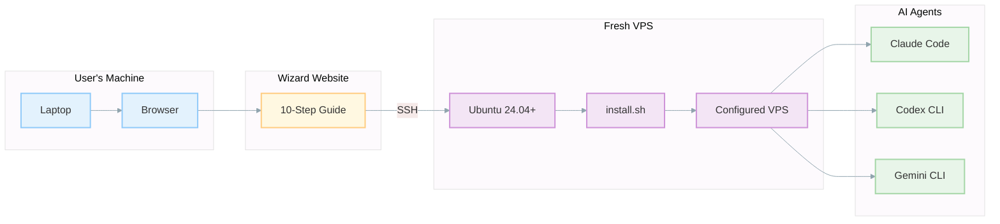
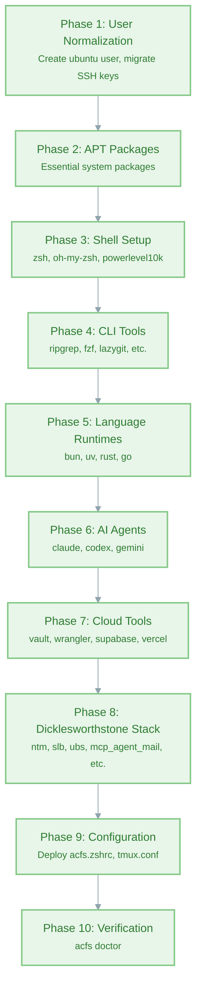

# Agentic Coding Flywheel Setup (ACFS)


<p align="center">
  <strong>🌐 <a href="https://agent-flywheel.com">agent-flywheel.com</a></strong> — Interactive setup wizard for beginners
</p>

> **From zero to fully-configured agentic coding VPS in 30 minutes.**
> A complete bootstrapping system that transforms a fresh Ubuntu VPS into a professional AI-powered development environment.

<div align="center" style="margin: 1.2em 0;">
  <table>
    <tr>
      <td align="center" style="padding: 8px;">
        <strong>The Vision</strong><br/>
        <sub>Beginner with laptop → Wizard → VPS → Agents coding for you</sub>
      </td>
    </tr>
  </table>
</div>

### Quick Install

```bash
curl -fsSL "https://raw.githubusercontent.com/Dicklesworthstone/agentic_coding_flywheel_setup/main/install.sh?$(date +%s)" | bash -s -- --yes --mode vibe
```

---

## TL;DR

**ACFS** is a complete system for bootstrapping agentic coding environments:

**Why you'd care:**
- **Zero to Hero:** Takes complete beginners from "I have a laptop" to "I have Claude/Codex/Gemini agents writing code for me on a VPS"
- **One-Liner Magic:** A single `curl | bash` command installs 30+ tools, configures everything, and sets up three AI coding agents
- **Vibe Mode:** Pre-configured for maximum velocity—passwordless sudo, dangerous agent flags enabled, optimized shell environment
- **Battle-Tested Stack:** Includes the complete Dicklesworthstone stack (8 tools) for agent orchestration, coordination, and safety

**What you get:**
- Modern shell (zsh + oh-my-zsh + powerlevel10k)
- All language runtimes (bun, uv/Python, Rust, Go)
- Three AI coding agents (Claude Code, Codex CLI, Gemini CLI)
- Agent coordination tools (NTM, MCP Agent Mail, SLB)
- Cloud CLIs (Vault, Wrangler, Supabase, Vercel)
- And 20+ more developer tools

---

## The ACFS Experience



### For Beginners
ACFS includes a **step-by-step wizard website** at [agent-flywheel.com](https://agent-flywheel.com) that guides complete beginners through:
1. Installing a terminal on their local machine
2. Generating SSH keys
3. Renting a VPS from providers like OVH, Contabo, or Hetzner
4. Connecting via SSH
5. Running the installer
6. Starting to code with AI agents

### For Developers
ACFS is a **one-liner** that transforms any fresh Ubuntu VPS into a fully-configured development environment with modern tooling and three AI coding agents ready to go.

### For Teams
ACFS provides a **reproducible, idempotent** setup that ensures every team member's VPS environment is identical—eliminating "works on my machine" for agentic workflows.

---

## Architecture & Design

ACFS is built around a **single source of truth**: the manifest file. Everything else—the installer scripts, doctor checks, website content—derives from this central definition. This architecture ensures consistency and makes the system easy to extend.

```
┌─────────────────────────────────────────────────────────────────────────────┐
│                            SOURCE OF TRUTH                                   │
│  ┌─────────────────────────────────────────────────────────────────────┐    │
│  │  acfs.manifest.yaml                                                  │    │
│  │  Tool Definitions • Install Commands • Verification Logic           │    │
│  └─────────────────────────────────────────────────────────────────────┘    │
└─────────────────────────────────────────────────────────────────────────────┘
                                      │
                    ┌─────────────────┴─────────────────┐
                    ▼                                   ▼
┌───────────────────────────────────┐   ┌───────────────────────────────────┐
│        CODE GENERATION            │   │        WIZARD WEBSITE             │
│  ┌─────────────────────────────┐  │   │  ┌─────────────────────────────┐  │
│  │ TypeScript Parser (Zod)     │  │   │  │ apps/web/ (Next.js 16)      │  │
│  │ generate.ts                 │  │   │  │ agent-flywheel.com          │  │
│  └─────────────────────────────┘  │   │  └─────────────────────────────┘  │
└───────────────────────────────────┘   └───────────────────────────────────┘
                    │
                    ▼
┌───────────────────────────────────────────────────────────────────────────┐
│                     GENERATED OUTPUTS (REFERENCE)                          │
│  ┌────────────────────┐  ┌────────────────────┐  ┌────────────────────┐   │
│  │ scripts/generated/ │  │ doctor_checks.sh   │  │ install_all.sh     │   │
│  │ 11 Category Scripts│  │ Verification Logic │  │ Master Installer   │   │
│  └────────────────────┘  └────────────────────┘  └────────────────────┘   │
└───────────────────────────────────────────────────────────────────────────┘
                    │
                    ▼
┌───────────────────────────────────────────────────────────────────────────┐
│                            INSTALLER                                       │
│  install.sh + scripts/lib/*.sh + checksums.yaml (SHA256 verification)     │
│  (scripts/generated/* are not invoked by install.sh yet)                   │
└───────────────────────────────────────────────────────────────────────────┘
                    │
                    ▼
┌───────────────────────────────────────────────────────────────────────────┐
│                           TARGET VPS                                       │
│  ┌──────────────┐  ┌──────────────┐  ┌──────────────┐  ┌──────────────┐   │
│  │ 30+ Tools    │  │ zsh + p10k   │  │ AI Agents    │  │ ~/.acfs/     │   │
│  │ Installed    │  │ Shell Config │  │ Claude/Codex │  │ Configurations│  │
│  └──────────────┘  └──────────────┘  └──────────────┘  └──────────────┘   │
└───────────────────────────────────────────────────────────────────────────┘
```

### Why This Architecture?

**Single Source of Truth**: The manifest file (`acfs.manifest.yaml`) defines every tool—its name, description, install commands, and verification logic. When you add or edit a tool in the manifest, the generator automatically updates the generated scripts and manifest-derived checks. The production one-liner installer (`install.sh`) is still hand-written today, so behavior changes may also require updating `install.sh` until full migration.

**TypeScript + Zod Validation**: The manifest parser uses Zod schemas to validate the YAML at parse time. Typos, missing fields, and structural errors are caught immediately during generation—not at runtime on a user's VPS when the installer fails halfway through.

**Generated Scripts**: Rather than hand-maintaining 11 category installer scripts and keeping them synchronized, the generator produces them from the manifest. This means:
- A consistent, auditable view of manifest-defined install logic (some modules intentionally emit TODOs)
- Consistent error handling and logging across all modules
- A clear path toward future installer integration

### Components

| Component | Path | Technology | Purpose |
|-----------|------|------------|---------|
| **Manifest** | `acfs.manifest.yaml` | YAML | Single source of truth for all tools |
| **Generator** | `packages/manifest/src/generate.ts` | TypeScript/Bun | Produces installer scripts from manifest |
| **Website** | `apps/web/` | Next.js 16 + Tailwind 4 | Step-by-step wizard for beginners |
| **Installer** | `install.sh` | Bash | One-liner bootstrap script |
| **Lib Scripts** | `scripts/lib/` | Bash | Modular installer functions |
| **Generated Scripts** | `scripts/generated/` | Bash | Auto-generated category installers (not wired into `install.sh` yet) |
| **Configs** | `acfs/` | Shell/Tmux configs | Files deployed to `~/.acfs/` |
| **Onboarding** | `acfs/onboard/` | Bash + Markdown | Interactive tutorial system |
| **Checksums** | `checksums.yaml` | YAML | SHA256 hashes for upstream installers |

---

## The Manifest System

`acfs.manifest.yaml` is the **single source of truth** for all tools installed by ACFS. It defines what gets installed, how to install it, and how to verify the installation worked.

### Manifest Structure

```yaml
version: "1.0"
meta:
  name: "ACFS"
  description: "Agentic Coding Flywheel Setup"
  version: "0.1.0"

modules:
  base.system:
    description: "Base packages + sane defaults"
    category: base
    install:
      - sudo apt-get update -y
      - sudo apt-get install -y curl git ca-certificates unzip tar xz-utils jq build-essential
    verify:
      - curl --version
      - git --version
      - jq --version

  agents.claude:
    description: "Claude Code"
    category: agents
    install:
      - "Install claude code via official method"
    verify:
      - claude --version || claude --help
```

Each module specifies:
- **description**: Human-readable name
- **category**: Grouping for installer organization (base, shell, cli, lang, tools, db, cloud, agents, stack, acfs)
- **install**: Commands to run (or descriptions that become TODOs)
- **verify**: Commands that must succeed to confirm installation

### The Generator Pipeline

The TypeScript generator (`packages/manifest/src/generate.ts`) reads the manifest and produces:

1. **Category Scripts** (`scripts/generated/install_base.sh`, `install_agents.sh`, etc.)
   - One script per category with individual install functions
   - Consistent logging and error handling
   - Verification checks after each module

2. **Doctor Checks** (`scripts/generated/doctor_checks.sh`)
   - All verify commands extracted into a runnable health check
   - Tab-delimited format (to safely handle `||` in shell commands)
   - Reports pass/fail/skip for each module

3. **Master Installer** (`scripts/generated/install_all.sh`)
   - Sources all category scripts
   - Runs them in dependency order
   - Single entry point for running the generated installers

> Note: The production one-liner installer (`install.sh`) does not invoke `scripts/generated/*` yet.

To regenerate after manifest changes:

```bash
cd packages/manifest
bun run generate        # Generate scripts
bun run generate:dry    # Preview without writing
```

### Why TypeScript for Code Generation?

Shell can parse YAML with `yq`, but TypeScript + Zod offers:
- **Type safety**: The parser knows the exact shape of a manifest
- **Validation**: Zod catches malformed YAML with descriptive errors
- **Transformation**: Complex logic (sorting by dependencies, escaping) is natural in TypeScript
- **Consistency**: All generated code follows the same patterns

The generator itself is ~400 lines of TypeScript. The generated output is ~1000 lines of Bash across 13 files. The trade-off is clearly in favor of maintaining the generator.

---

## Security Verification

ACFS downloads and executes installer scripts from the internet. This is inherently risky—a compromised upstream could inject malicious code. The security verification system mitigates this risk.

### How It Works

The `checksums.yaml` file contains SHA256 hashes for all upstream installer scripts:

```yaml
# checksums.yaml
installers:
  bun:
    url: "https://bun.sh/install"
    sha256: "a1b2c3d4..."

  rust:
    url: "https://sh.rustup.rs"
    sha256: "e5f6a7b8..."
```

The security library (`scripts/lib/security.sh`) provides:

1. **HTTPS Enforcement**: All installer URLs must use HTTPS. Non-HTTPS URLs fail immediately.

2. **Checksum Verification**: Before executing a downloaded script, the system:
   - Downloads the content to memory
   - Calculates the SHA256 hash
   - Compares against the stored hash
   - Only executes if they match

3. **Verification Modes**:
   ```bash
   ./scripts/lib/security.sh --print              # List all upstream URLs
   ./scripts/lib/security.sh --verify             # Verify all against saved checksums
   ./scripts/lib/security.sh --update-checksums   # Generate new checksums.yaml
   ./scripts/lib/security.sh --checksum URL       # Calculate SHA256 of any URL
   ```

### When Checksums Fail

A checksum mismatch can mean:
1. **Normal update**: The upstream maintainer released a new version
2. **Potential compromise**: Someone modified the script maliciously

The verification report distinguishes these cases:
- If multiple checksums fail simultaneously, investigate before updating
- If a single checksum fails after a known release, update is likely safe

To update after verifying a legitimate upstream change:
```bash
./scripts/lib/security.sh --update-checksums > checksums.yaml
git diff checksums.yaml  # Review what changed
git commit -m "chore: update upstream checksums"
```

### Why This Approach?

The `curl | bash` pattern is controversial but practical. ACFS makes it safer by:
- Verifying content before execution (not just transport via HTTPS)
- Making checksums auditable in version control
- Providing tools to detect and investigate changes
- Failing closed (no execution on mismatch)

This is defense in depth—HTTPS protects transport, checksums protect content.

---

## The Installer

The installer is the heart of ACFS—a modular Bash script that transforms a fresh Ubuntu VPS into a fully-configured development environment.

### Usage

```bash
# Full vibe mode (recommended for throwaway VPS)
curl -fsSL "https://raw.githubusercontent.com/Dicklesworthstone/agentic_coding_flywheel_setup/main/install.sh?$(date +%s)" | bash -s -- --yes --mode vibe

# Interactive mode (asks for confirmation)
curl -fsSL "https://raw.githubusercontent.com/Dicklesworthstone/agentic_coding_flywheel_setup/main/install.sh" | bash

# Safe mode (no passwordless sudo, agent confirmations enabled)
curl -fsSL "https://raw.githubusercontent.com/Dicklesworthstone/agentic_coding_flywheel_setup/main/install.sh" | bash -s -- --mode safe
```

### Installer Modes

| Mode | Passwordless Sudo | Agent Flags | Best For |
|------|-------------------|-------------|----------|
| **vibe** | Yes | `--dangerously-skip-permissions` | Throwaway VPS, maximum velocity |
| **safe** | No | Standard confirmations | Production-like environments |

### Installation Phases



### Key Properties

| Property | Description |
|----------|-------------|
| **Idempotent** | Safe to re-run; skips already-installed tools |
| **Checkpointed** | Phases resume on failure |
| **Logged** | Colored output with progress indicators |
| **Modular** | Each category is a separate sourceable script |

### Console Output

The installer uses semantic colors for progress visibility:

```bash
[1/8] Installing essential packages...     # Blue: progress steps
    Installing zsh, git, curl...           # Gray: details
⚠️  May take a few minutes                 # Yellow: warnings
✖ Failed to install package               # Red: errors
✔ Shell setup complete                    # Green: success
```

---

## The Update Command

After installation, keeping tools current is handled by `acfs update`. It provides a unified interface for updating all installed components.

### Usage

```bash
acfs update                  # Update apt, agents, and cloud CLIs
acfs update --stack          # Include Dicklesworthstone stack tools
acfs update --agents-only    # Only update coding agents
acfs update --dry-run        # Preview changes without making them
```

### What Gets Updated

| Category | Tools | Method |
|----------|-------|--------|
| **System** | apt packages | `apt update && apt upgrade` |
| **Runtime** | Bun | `bun upgrade` |
| **Agents** | Claude, Codex, Gemini | `claude update`, `bun install -g` |
| **Cloud** | Wrangler, Supabase, Vercel | `bun install -g @latest` |
| **Rust** | rustc, cargo | `rustup update stable` |
| **Python** | uv | `uv self update` |
| **Stack** | ntm, slb, ubs, etc. | Re-run upstream installers |

### Options

```bash
--apt-only       Only update system packages
--agents-only    Only update coding agents
--cloud-only     Only update cloud CLIs
--stack          Include Dicklesworthstone stack (disabled by default)
--no-apt         Skip apt updates
--no-agents      Skip agent updates
--no-cloud       Skip cloud CLI updates
--force          Install missing tools
--dry-run        Show what would be updated
--verbose        Show command details
```

### Why Separate from the Installer?

The installer transforms a fresh VPS. The update command maintains an existing installation. Separating them allows:
- **Focused updates**: Update just agents without touching system packages
- **Dry-run previews**: See what would change before committing
- **Skip flags**: Temporarily exclude categories that are working fine
- **Stack control**: The full stack reinstallation is opt-in (it's slow)

---

## Interactive Onboarding

After installation, users can learn the ACFS workflow through an interactive tutorial system. The onboarding TUI guides users through 8 lessons covering Linux basics through full agentic workflows.

### Running Onboarding

```bash
onboard                # Launch interactive menu
onboard --list         # List lessons with completion status
onboard 3              # Jump to lesson 3
onboard --reset        # Reset progress and start fresh
```

### Lessons

| # | Title | Duration | Topics |
|---|-------|----------|--------|
| 0 | Welcome & Overview | 2 min | What's installed, system overview |
| 1 | Linux Navigation | 5 min | Filesystem, basic commands |
| 2 | SSH & Persistence | 4 min | Keys, config, tunnels, screen/tmux |
| 3 | tmux Basics | 6 min | Sessions, windows, panes, navigation |
| 4 | Agent Commands | 5 min | `cc`, `cod`, `gmi` aliases |
| 5 | NTM Core | 7 min | Named Tmux Manager basics |
| 6 | NTM Prompt Palette | 5 min | Command palette features |
| 7 | Flywheel Loop | 8 min | Complete agentic workflow |

### Progress Tracking

Progress is saved in `~/.acfs/onboard_progress.json`:

```json
{
  "completed": [0, 1, 2],
  "current": 3,
  "started_at": "2024-12-20T10:30:00-05:00"
}
```

The TUI shows completion status for each lesson and suggests the next one to take. Users can jump to any lesson or re-take completed ones.

### Enhanced UX with Gum

If [Charmbracelet Gum](https://github.com/charmbracelet/gum) is installed, the onboarding system uses it for enhanced terminal UI—selection menus, styled prompts, and better formatting. Without Gum, it falls back to simple numbered menus that work everywhere.

---

## Tools Installed

ACFS installs a comprehensive suite of **30+ tools** organized into categories:

### Shell & Terminal UX

| Tool | Command | Description |
|------|---------|-------------|
| **zsh** | `zsh` | Modern shell |
| **oh-my-zsh** | - | zsh plugin framework |
| **powerlevel10k** | - | Fast, customizable prompt |
| **lsd** | `ls` (aliased) | Modern ls with icons |
| **atuin** | `Ctrl+R` | Shell history with search |
| **fzf** | `fzf` | Fuzzy finder |
| **zoxide** | `z` | Smarter cd |
| **direnv** | - | Directory-specific env vars |

### Languages & Package Managers

| Tool | Command | Description |
|------|---------|-------------|
| **bun** | `bun` | Fast JS/TS runtime + package manager |
| **uv** | `uv` | Fast Python package manager |
| **Rust** | `cargo` | Rust toolchain |
| **Go** | `go` | Go toolchain |

### Dev Tools

| Tool | Command | Description |
|------|---------|-------------|
| **tmux** | `tmux` | Terminal multiplexer |
| **ripgrep** | `rg` | Fast recursive grep |
| **ast-grep** | `sg` | Structural code search |
| **lazygit** | `lg` (aliased) | Git TUI |
| **GitHub CLI** | `gh` | GitHub auth, issues, PRs |
| **Git LFS** | `git-lfs` | Large file support for Git |
| **bat** | `cat` (aliased) | Cat with syntax highlighting |
| **neovim** | `nvim` | Modern vim |
| **jq** | `jq` | JSON processor |
| **rsync** | `rsync` | Fast file sync/copy |
| **lsof** | `lsof` | Debug open files/ports |
| **dnsutils** | `dig` | DNS debugging |
| **netcat** | `nc` | Network debugging |
| **strace** | `strace` | Syscall tracing |

### AI Coding Agents

| Agent | Command | Alias (Vibe Mode) |
|-------|---------|-------------------|
| **Claude Code** | `claude` | `cc` (dangerous mode) |
| **Codex CLI** | `codex` | `cod` (dangerous mode) |
| **Gemini CLI** | `gemini` | `gmi` (dangerous mode) |

**Vibe Mode Aliases:**
```bash
# Claude Code with max memory and background tasks
alias cc='NODE_OPTIONS="--max-old-space-size=32768" ENABLE_BACKGROUND_TASKS=1 claude --dangerously-skip-permissions'

# Codex with bypass, max reasoning, and dangerous filesystem access
alias cod='codex --dangerously-bypass-approvals-and-sandbox -m gpt-5.2-codex ...'

# Gemini with yolo mode
alias gmi='gemini --yolo --model gemini-3-pro-preview'
```

### Cloud & Database

| Tool | Command | Description |
|------|---------|-------------|
| **PostgreSQL 18** | `psql` | Database |
| **HashiCorp Vault** | `vault` | Secrets management |
| **Wrangler** | `wrangler` | Cloudflare CLI |
| **Supabase CLI** | `supabase` | Supabase management |
| **Vercel CLI** | `vercel` | Vercel deployment |

### Dicklesworthstone Stack (8 Tools)

The complete suite of tools for professional agentic workflows:

| # | Tool | Command | Description |
|---|------|---------|-------------|
| 1 | **Named Tmux Manager** | `ntm` | Agent cockpit—spawn, orchestrate, monitor tmux sessions |
| 2 | **MCP Agent Mail** | - | Agent coordination via mail-like messaging |
| 3 | **Ultimate Bug Scanner** | `ubs` | Bug scanning with guardrails |
| 4 | **Beads Viewer** | `bv` | Task management TUI with graph analysis |
| 5 | **Coding Agent Session Search** | `cass` | Unified agent history search |
| 6 | **CASS Memory System** | `cm` | Procedural memory for agents |
| 7 | **Coding Agent Account Manager** | `caam` | Agent auth switching |
| 8 | **Simultaneous Launch Button** | `slb` | Two-person rule for dangerous commands |

---

## Doctor Command

`acfs doctor` performs comprehensive health checks on your installation:

```bash
$ acfs doctor

╔══════════════════════════════════════════════════════════════╗
║                    ACFS Health Check                          ║
╠══════════════════════════════════════════════════════════════╣
║ Identity                                                      ║
║   ✔ Running as ubuntu user                                    ║
║   ✔ Passwordless sudo enabled                                 ║
║                                                               ║
║ Workspace                                                     ║
║   ✔ /data/projects exists                                     ║
║                                                               ║
║ Shell                                                         ║
║   ✔ zsh installed                                             ║
║   ✔ oh-my-zsh installed                                       ║
║   ✔ powerlevel10k installed                                   ║
║   ✔ acfs.zshrc sourced                                        ║
║                                                               ║
║ Core Tools                                                    ║
║   ✔ bun 1.2.16                                                ║
║   ✔ uv 0.5.14                                                 ║
║   ✔ cargo 1.84.0                                              ║
║   ✔ go 1.23.4                                                 ║
║   ✔ ripgrep 14.1.0                                            ║
║   ✔ ast-grep 0.30.1                                           ║
║                                                               ║
║ Agents                                                        ║
║   ✔ claude 1.0.24                                             ║
║   ✔ codex 0.1.2504252326                                      ║
║   ✔ gemini 0.1.12                                             ║
║                                                               ║
║ Cloud                                                         ║
║   ✔ vault 1.18.3                                              ║
║   ✔ wrangler 4.16.0                                           ║
║   ✔ supabase 2.23.4                                           ║
║   ✔ vercel 41.7.6                                             ║
║                                                               ║
║ Dicklesworthstone Stack                                       ║
║   ✔ ntm 0.3.2                                                 ║
║   ✔ slb 0.2.1                                                 ║
║   ✔ ubs 0.1.8                                                 ║
║   ✔ bv 0.9.4                                                  ║
║   ✔ cass 0.4.2                                                ║
║   ✔ cm 0.1.3                                                  ║
║   ✔ caam 0.2.0                                                ║
║   ⚠ mcp_agent_mail (not running)                              ║
╠══════════════════════════════════════════════════════════════╣
║ Overall: 31/32 checks passed                                  ║
╚══════════════════════════════════════════════════════════════╝
```

### Generated Doctor Checks

Doctor checks can be generated from the manifest (`scripts/generated/doctor_checks.sh`) to keep verification logic close to `acfs.manifest.yaml`. Today, the user-facing `acfs doctor` command is implemented in `scripts/lib/doctor.sh` and does not yet consume the generated `doctor_checks.sh` output.

### Options

```bash
acfs doctor          # Interactive colorful output
acfs doctor --json   # Machine-readable JSON output
acfs doctor --quiet  # Exit code only (0=healthy, 1=issues)
```

---

## The Wizard Website

The wizard guides beginners through a **10-step journey** from "I have a laptop" to "AI agents are coding for me":

```
┌─────────────────────────────────────────────────────────────────────────────┐
│  ACFS Wizard                                                   [Step 3/10]  │
├─────────────────────────────────────────────────────────────────────────────┤
│                                                                             │
│  ┌────────────────────────────────────────────────────────────────────────┐ │
│  │  STEP 3: Generate SSH Key                                              │ │
│  │  ──────────────────────────────────────────────────────────────────    │ │
│  │                                                                        │ │
│  │  Run this command in your terminal:                                    │ │
│  │                                                                        │ │
│  │  ┌─────────────────────────────────────────────────────────────────┐  │ │
│  │  │ ssh-keygen -t ed25519 -C "your-email@example.com"         [📋] │  │ │
│  │  └─────────────────────────────────────────────────────────────────┘  │ │
│  │                                                                        │ │
│  │  ☐ I ran this command                                                  │ │
│  │                                                                        │ │
│  │  [← Previous]                                        [Next Step →]     │ │
│  └────────────────────────────────────────────────────────────────────────┘ │
│                                                                             │
│  Progress: ●●●○○○○○○○                                                      │
└─────────────────────────────────────────────────────────────────────────────┘
```

### Wizard Steps

| Step | Title | What Happens |
|------|-------|--------------|
| 1 | **Choose Your OS** | Select Mac or Windows (auto-detected) |
| 2 | **Install Terminal** | Windows Terminal or Homebrew instructions |
| 3 | **Generate SSH Key** | Create ed25519 key for VPS access |
| 4 | **Rent a VPS** | Links to OVH, Contabo, Hetzner with pricing |
| 5 | **Create VPS Instance** | Checklist for VPS setup with SSH key |
| 6 | **SSH Connect** | First connection with troubleshooting tips |
| 7 | **Run Installer** | The `curl \| bash` one-liner |
| 8 | **Reconnect as Ubuntu** | Post-install reconnection |
| 9 | **Status Check** | Run `acfs doctor` to verify |
| 10 | **Launch Onboarding** | Start the interactive tutorial |

### Key Features

- **OS Detection:** Auto-detects Mac vs Windows for tailored instructions
- **Copy-to-Clipboard:** One-click copy for all commands
- **Progress Tracking:** localStorage persistence across browser sessions
- **Confirmation Checkboxes:** "I ran this command" acknowledgments
- **Troubleshooting:** Expandable help for common issues

### Technology Stack

```
Next.js 16 (App Router)
├── React 19
├── Tailwind CSS 4 (OKLCH colors)
├── shadcn/ui components
├── Radix UI primitives
└── Lucide icons
```

**No backend required.** All state is stored in:
- URL query parameters
- localStorage (`acfs-user-os`, `acfs-vps-ip`, `acfs-wizard-completed-steps`)

---

## Configuration Files

ACFS deploys optimized configuration files to `~/.acfs/` on the target VPS.

### `~/.acfs/zsh/acfs.zshrc`

A comprehensive zsh configuration that's sourced by `~/.zshrc`:

**Path Configuration:**
```bash
export PATH="$HOME/.local/bin:$PATH"
export PATH="$HOME/.cargo/bin:$PATH"
export PATH="$HOME/go/bin:$PATH"
export PATH="$HOME/.bun/bin:$PATH"
export PATH="$HOME/.atuin/bin:$PATH"
```

**Modern CLI Aliases:**
```bash
alias ls='lsd --inode --long --all'
alias ll='lsd -l'
alias tree='lsd --tree'
alias cat='bat'
alias grep='rg'
alias vim='nvim'
alias lg='lazygit'
```

**Tool Integrations:**
```bash
# Atuin (better shell history)
eval "$(atuin init zsh)"

# Zoxide (smarter cd)
eval "$(zoxide init zsh)"

# direnv (directory env vars)
eval "$(direnv hook zsh)"

# fzf (fuzzy finder)
source /usr/share/doc/fzf/examples/key-bindings.zsh
```

### `~/.acfs/tmux/tmux.conf`

An optimized tmux configuration:

**Key Bindings:**
```
Prefix: Ctrl+a (not Ctrl+b)
Split horizontal: |
Split vertical: -
Navigate panes: h/j/k/l (vim-style)
```

**Features:**
- Mouse support enabled
- Catppuccin-inspired colors
- Status bar at top
- Larger scrollback buffer (50,000 lines)

---

## Library Modules

The installer is organized into modular Bash libraries in `scripts/lib/`:

### `logging.sh`

Colored console output utilities:

```bash
log_step "1/8" "Installing packages..."  # Blue step indicator
log_detail "Installing zsh..."           # Gray indented detail
log_success "Complete"                    # Green checkmark
log_warn "May take a while"              # Yellow warning
log_error "Failed"                        # Red error
log_fatal "Cannot continue"              # Red error + exit 1
```

### `security.sh`

HTTPS enforcement and checksum verification:

```bash
enforce_https "$url"                     # Fail if not HTTPS
verify_checksum "$url" "$sha256" "$name" # Verify before execute
fetch_and_run "$url" "$sha256" "$name"   # Verify + execute in one
```

### `os_detect.sh`

OS detection and validation:

```bash
detect_os()      # Sets OS_ID, OS_VERSION, OS_CODENAME
validate_os()    # Checks for Ubuntu 24.04+
is_fresh_vps()   # Heuristic detection of fresh VPS
get_arch()       # Returns amd64/arm64
is_wsl()         # Detects WSL
is_docker()      # Detects Docker container
```

### `user.sh`

User account normalization:

```bash
ensure_user()              # Creates ubuntu user if missing
enable_passwordless_sudo() # Adds NOPASSWD to sudoers
migrate_ssh_keys()         # Copies keys from root to ubuntu
normalize_user()           # Full normalization sequence
```

### `update.sh`

Component update logic:

```bash
update_apt()       # apt update/upgrade
update_bun()       # bun upgrade
update_agents()    # Claude, Codex, Gemini
update_cloud()     # Wrangler, Supabase, Vercel
update_rust()      # rustup update
update_uv()        # uv self update
update_stack()     # Dicklesworthstone stack tools
```

### `gum_ui.sh`

Enhanced terminal UI using Charmbracelet Gum:

```bash
print_banner()           # ASCII art ACFS banner
gum_step/gum_detail      # Styled output
gum_success/warn/error   # Colored messages
gum_spin                 # Spinner for long operations
gum_confirm              # Yes/No prompt
gum_choose               # Selection menu
```

Falls back to basic echo if Gum is not installed.

---

## MCP Agent Mail Integration

ACFS includes integration with **MCP Agent Mail** for multi-agent coordination:

### What Agent Mail Provides

- **Identities:** Each agent registers with a unique name
- **Inbox/Outbox:** Message-based communication between agents
- **File Reservations:** Advisory leases to prevent agents from clobbering each other's work
- **Searchable Threads:** Full-text search across all messages
- **Git Persistence:** All artifacts stored in git for human auditability

### Core Patterns

**1. Register Identity:**
```bash
# In your agent, call:
mcp.ensure_project(project_key="/data/projects/my-project")
mcp.register_agent(project_key=..., program="claude-code", model="opus-4.1")
```

**2. Reserve Files Before Editing:**
```bash
mcp.file_reservation_paths(
    project_key=...,
    agent_name="BlueLake",
    paths=["src/**"],
    ttl_seconds=3600,
    exclusive=true
)
```

**3. Communicate:**
```bash
mcp.send_message(
    project_key=...,
    sender_name="BlueLake",
    to=["GreenCastle"],
    subject="Review needed",
    body_md="Please review the auth changes..."
)
```

### Macros for Speed

When speed matters more than fine-grained control:

```bash
mcp.macro_start_session(...)      # Ensure project + register + fetch inbox
mcp.macro_prepare_thread(...)     # Align with existing thread
mcp.macro_file_reservation_cycle(...)  # Reserve + work + release
mcp.macro_contact_handshake(...)  # Request contact permissions
```

---

## CI/CD

ACFS uses GitHub Actions for continuous integration:

### Installer Testing (`installer.yml`)

```yaml
# Runs on every push and PR
jobs:
  shellcheck:
    - Lints all bash scripts with ShellCheck

  integration:
    - Matrix tests across Ubuntu 24.04, 24.10, 25.04
    - Runs full installation in Docker
    - Verifies all tools installed correctly
    - Runs acfs doctor to confirm health
```

This ensures the installer works on all supported Ubuntu versions and catches shell scripting issues early.

### Website Deployment (`website.yml`)

```yaml
# Builds and deploys the Next.js wizard
jobs:
  build:
    - Type-check TypeScript
    - Run ESLint
    - Build production bundle

  deploy:
    - Deploy to Vercel (production)
```

---

## VPS Providers

ACFS works on any Ubuntu VPS. Here are recommended providers:

### OVH (Recommended for EU)

| Plan | RAM | Storage | Price | Notes |
|------|-----|---------|-------|-------|
| VPS Starter | 2GB | 20GB | €3.50/mo | Good for testing |
| VPS Essential | 4GB | 80GB | €7/mo | Recommended minimum |
| VPS Comfort | 8GB | 160GB | €14/mo | Comfortable for agents |

### Contabo (Best Value)

| Plan | RAM | Storage | Price | Notes |
|------|-----|---------|-------|-------|
| Cloud VPS S | 8GB | 200GB | €4.99/mo | Excellent value |
| Cloud VPS M | 16GB | 400GB | €8.99/mo | Great for heavy usage |
| Cloud VPS L | 32GB | 800GB | €15.99/mo | Multi-agent workloads |

### Hetzner (Best Performance)

| Plan | RAM | Storage | Price | Notes |
|------|-----|---------|-------|-------|
| CX22 | 4GB | 40GB | €4.35/mo | Fast NVMe |
| CX32 | 8GB | 80GB | €8.35/mo | Recommended |
| CX42 | 16GB | 160GB | €16.35/mo | Heavy workloads |

### Requirements

| Requirement | Minimum | Recommended |
|-------------|---------|-------------|
| **OS** | Ubuntu 24.04 LTS | Ubuntu 25.04 |
| **RAM** | 4GB | 8GB+ |
| **Storage** | 40GB | 80GB+ |
| **CPU** | 2 vCPU | 4 vCPU |
| **Network** | SSH access | Low latency |

Detailed provider setup guides are available in `scripts/providers/`:
- `ovh.md` - Step-by-step OVH setup
- `contabo.md` - Step-by-step Contabo setup
- `hetzner.md` - Step-by-step Hetzner setup

---

## Project Structure

```
agentic_coding_flywheel_setup/
├── README.md                     # This file
├── AGENTS.md                     # Development guidelines
├── VERSION                       # Current version (0.1.0)
├── install.sh                    # Main installer entry point
├── acfs.manifest.yaml            # Canonical tool manifest (510 lines)
├── checksums.yaml                # SHA256 hashes for upstream scripts
├── package.json                  # Root monorepo config
│
├── apps/
│   └── web/                      # Next.js 16 wizard website
│       ├── app/                  # App Router pages
│       │   ├── layout.tsx        # Root layout
│       │   ├── page.tsx          # Landing page
│       │   └── wizard/           # Wizard step pages
│       ├── components/           # UI components
│       └── lib/                  # Utilities
│
├── packages/
│   ├── manifest/                 # Manifest parser + generator
│   │   └── src/
│   │       ├── parser.ts         # YAML parsing
│   │       ├── schema.ts         # Zod validation schemas
│   │       ├── types.ts          # TypeScript types
│   │       ├── utils.ts          # Helper functions
│   │       └── generate.ts       # Script generator
│   ├── installer/                # Installer helper scripts
│   └── onboard/                  # Onboard TUI source
│
├── acfs/                         # Files deployed to ~/.acfs/
│   ├── zsh/
│   │   └── acfs.zshrc            # Shell configuration
│   ├── tmux/
│   │   └── tmux.conf             # Tmux configuration
│   └── onboard/
│       ├── onboard.sh            # Onboarding TUI script
│       └── lessons/              # Tutorial markdown (8 files)
│
├── scripts/
│   ├── lib/                      # Installer bash libraries
│   │   ├── logging.sh            # Console output
│   │   ├── security.sh           # HTTPS + checksum verification
│   │   ├── os_detect.sh          # OS detection
│   │   ├── user.sh               # User management
│   │   ├── zsh.sh                # Shell setup
│   │   ├── update.sh             # Update command logic
│   │   ├── gum_ui.sh             # Enhanced UI
│   │   ├── cli_tools.sh          # Tool installation
│   │   └── doctor.sh             # Health checks
│   ├── generated/                # Auto-generated from manifest
│   │   ├── install_base.sh       # Base packages
│   │   ├── install_shell.sh      # Shell tools
│   │   ├── install_cli.sh        # CLI tools
│   │   ├── install_lang.sh       # Language runtimes
│   │   ├── install_agents.sh     # AI coding agents
│   │   ├── install_cloud.sh      # Cloud CLIs
│   │   ├── install_stack.sh      # Dicklesworthstone stack
│   │   ├── install_all.sh        # Master installer
│   │   └── doctor_checks.sh      # Verification checks
│   ├── providers/                # VPS provider guides
│   │   ├── ovh.md
│   │   ├── contabo.md
│   │   └── hetzner.md
│   └── sync/
│       └── sync_ntm_palette.sh   # Sync NTM command palette
│
├── .github/
│   └── workflows/
│       ├── installer.yml         # ShellCheck + Ubuntu matrix tests
│       └── website.yml           # Next.js build + deploy
│
└── tests/
    └── vm/
        └── test_install_ubuntu.sh # Docker integration test
```

---

## Development

### Website Development

```bash
cd apps/web
bun install           # Install dependencies
bun run dev           # Dev server at http://localhost:3000
bun run build         # Production build
bun run lint          # Lint check
bun run type-check    # TypeScript check
```

### Manifest Development

```bash
cd packages/manifest
bun install           # Install dependencies
bun run generate      # Generate installer scripts
bun run generate:dry  # Preview without writing files
```

### Installer Testing

```bash
# Local lint
shellcheck install.sh scripts/lib/*.sh

# Full installer integration test (Docker, same as CI)
./tests/vm/test_install_ubuntu.sh
```

### Security Verification

```bash
# Print all upstream URLs
./scripts/lib/security.sh --print

# Verify all checksums
./scripts/lib/security.sh --verify

# Update checksums after reviewing upstream changes
./scripts/lib/security.sh --update-checksums > checksums.yaml
```

### Requirements

- **Runtime:** Bun (not npm/yarn/pnpm)
- **Node:** Latest
- **Shell:** Bash 5+

---

## FAQ

### Why "Vibe Mode"?

Vibe mode is designed for **throwaway VPS environments** where velocity matters more than safety:
- Passwordless sudo eliminates friction
- Agent dangerous flags skip confirmation dialogs
- Pre-configured aliases for maximum speed

**Never use vibe mode on production or shared systems.**

### Can I use this on my local machine?

ACFS is designed for fresh Ubuntu VPS instances. While you *could* run it locally:
- It may conflict with existing configurations
- It assumes root/sudo access
- It's not designed for macOS or Windows

For local development, use the individual tools directly.

### What if the installer fails?

The installer is **checkpointed**. Simply re-run it:
```bash
curl -fsSL "https://raw.githubusercontent.com/Dicklesworthstone/agentic_coding_flywheel_setup/main/install.sh?$(date +%s)" | bash -s -- --yes --mode vibe
```

It will skip already-completed phases and resume where it left off.

### How do I update tools?

Use the built-in update command:
```bash
acfs update                  # Update all standard components
acfs update --stack          # Include Dicklesworthstone stack
acfs update --agents-only    # Just update AI agents
```

### How do I uninstall?

There's no uninstall script. To reset:
1. Delete the VPS instance
2. Create a new one
3. Run the installer fresh

This is intentional—ACFS is designed for ephemeral VPS environments.

### Can I customize which tools are installed?

Currently, ACFS installs the full suite. Future versions will support:
- Manifest-based tool selection
- Interactive mode for choosing components
- Modular installation scripts

---

## Why ACFS Exists

### The Problem: The Agentic Coding Barrier

The rise of AI coding agents (Claude Code, Codex CLI, Gemini CLI) has created a new paradigm in software development. These agents can write code, debug issues, and even architect solutions—but only if they have the right environment.

**The barrier isn't the agents themselves.** It's the **hours of setup** required to create an environment where agents can actually be productive:

```
┌────────────────────────────────────────────────────────────────────────────┐
│  TIME INVESTMENT WITHOUT ACFS                                               │
│                                                                              │
│  VPS Setup ..................... 30-60 min                                   │
│  Shell Configuration ........... 20-30 min                                   │
│  Language Runtimes ............. 30-45 min                                   │
│  Dev Tools ..................... 20-30 min                                   │
│  Agent Installation ............ 15-30 min                                   │
│  Agent Configuration ........... 20-40 min                                   │
│  Coordination Tools ............ 30-60 min                                   │
│  Troubleshooting ............... 30-120 min                                  │
│  ─────────────────────────────────────────                                   │
│  TOTAL: 3-7 hours (and that's if everything works)                          │
│                                                                              │
│  TIME INVESTMENT WITH ACFS                                                   │
│                                                                              │
│  Run one command ............... 25-30 min                                   │
│  ─────────────────────────────────────────                                   │
│  TOTAL: 30 minutes                                                           │
└────────────────────────────────────────────────────────────────────────────┘
```

**ACFS eliminates this barrier entirely.** One command, 30 minutes, fully configured.

### The Deeper Problem: Beginners Can't Start

For experienced developers, the setup is tedious but doable. For beginners—the people who would benefit *most* from AI coding assistance—it's an insurmountable wall:

- What's SSH? How do I generate keys?
- What's a VPS? How do I rent one?
- What's a terminal? Which one should I use?
- How do I connect to a remote server?
- What are all these tools and why do I need them?

The [wizard website at agent-flywheel.com](https://agent-flywheel.com) solves this by providing:

1. **Absolute beginner guidance** — Explains every concept in plain English
2. **OS-specific instructions** — Detects Mac vs Windows, shows the right commands
3. **Visual confirmations** — Checkboxes for each step, copy buttons for commands
4. **Troubleshooting help** — Expandable sections for common problems
5. **Progress persistence** — Resume where you left off across browser sessions

---

## The 10x Multiplier Effect

ACFS isn't just a collection of tools—it's a **carefully curated system** where each component amplifies the others. The value isn't additive; it's multiplicative.

### Tool Synergy Model

```
                              ┌─────────────────┐
                              │   PRODUCTIVITY  │
                              │   MULTIPLIER    │
                              └────────┬────────┘
                                       │
         ┌─────────────────────────────┼─────────────────────────────┐
         │                             │                             │
         ▼                             ▼                             ▼
┌─────────────────┐         ┌─────────────────┐         ┌─────────────────┐
│  ENVIRONMENT    │         │    AGENTS       │         │  COORDINATION   │
│  LAYER          │         │    LAYER        │         │  LAYER          │
├─────────────────┤         ├─────────────────┤         ├─────────────────┤
│ • zsh + p10k    │────────▶│ • Claude Code   │────────▶│ • Agent Mail    │
│ • tmux          │         │ • Codex CLI     │         │ • NTM           │
│ • Modern CLI    │         │ • Gemini CLI    │         │ • SLB           │
│ • Language VMs  │         │                 │         │ • Beads Viewer  │
└─────────────────┘         └─────────────────┘         └─────────────────┘
         │                             │                             │
         │    Each layer enables       │    Agents become more      │
         │    the next layer           │    powerful together       │
         └─────────────────────────────┴─────────────────────────────┘
```

### Why These Specific Tools?

Every tool in ACFS earns its place through **concrete productivity gains**:

| Tool | Individual Value | Synergy Value |
|------|-----------------|---------------|
| **tmux** | Persistent sessions | Agents can work while you're disconnected |
| **NTM** | Organized sessions | One command spawns 10 agents in named windows |
| **Agent Mail** | Message passing | Agents coordinate without conflicts |
| **SLB** | Two-person rule | Dangerous operations require confirmation |
| **Beads Viewer** | Task tracking | Agents can see project state, avoid rework |
| **atuin** | Shell history | Search commands across sessions, share patterns |
| **zoxide** | Smart cd | `z proj` beats `cd ~/projects/my-long-name` |
| **ripgrep** | Fast search | Agents find code 100x faster than grep |
| **fzf** | Fuzzy finding | Interactive selection instead of typing paths |

### The Compounding Effect

A single agent with basic tooling is useful. Three agents with:
- A shared project structure
- Coordination via Agent Mail
- Orchestration via NTM
- Safety guardrails via SLB
- Task visibility via Beads

...can accomplish in one day what would take a solo developer a week.

**This is the flywheel effect in action.** Better tools → more capable agents → more code shipped → better understanding of what tools are needed → better tools.

---

## Design Algorithms & Decisions

ACFS implements several algorithmic patterns that ensure reliability and maintainability.

### Idempotency Algorithm

Every installation function follows the **check-before-install** pattern:

```bash
install_tool() {
    if command_exists "tool"; then
        log_success "tool already installed"
        return 0
    fi

    # ... installation logic ...

    if command_exists "tool"; then
        log_success "tool installed successfully"
        return 0
    else
        log_error "tool installation failed"
        return 1
    fi
}
```

This guarantees:
1. **Safe re-runs** — Running the installer twice doesn't break anything
2. **Resume capability** — Failures don't require starting over
3. **Declarative intent** — The end state is defined, not the transition

### Checksum Verification Algorithm

The security system uses **content-addressable verification**:

```
┌─────────────────────────────────────────────────────────────────────────┐
│  VERIFICATION FLOW                                                       │
│                                                                          │
│  1. Download script to memory (not disk)                                 │
│  2. Calculate SHA256 of downloaded content                               │
│  3. Compare against stored hash in checksums.yaml                        │
│  4. If match → execute                                                   │
│  5. If mismatch → refuse execution, report discrepancy                   │
│                                                                          │
│  Key insight: We verify CONTENT, not just transport                      │
│  (HTTPS only protects the channel, not the content at source)            │
└─────────────────────────────────────────────────────────────────────────┘
```

### Manifest-Driven Generation

The generator uses a **template expansion** pattern:

1. **Parse** — Read YAML manifest, validate with Zod schemas
2. **Transform** — Convert manifest entries to installation functions
3. **Group** — Organize by category (base, shell, cli, lang, agents, etc.)
4. **Generate** — Emit Bash scripts with consistent structure
5. **Verify** — Generate doctor checks from verification commands

This ensures the manifest is the **single source of truth**—no drift between documentation, installer, and verification.

### Progressive Disclosure in the Wizard

The wizard website implements **progressive disclosure** for complexity management:

```
Level 1: Core instructions (visible by default)
├── Copy this command
├── Paste in terminal
└── Press Enter

Level 2: Troubleshooting (expandable)
├── "Permission denied" → fix instructions
├── "Command not found" → prerequisites
└── "Connection refused" → diagnostics

Level 3: Deep explanations (collapsible "Beginner Guide")
├── What is SSH?
├── What is a VPS?
├── Why these specific steps?
└── What happens under the hood?
```

This allows beginners to get deep context when needed, while experts can skip straight to the commands.

---

## Multi-Agent Orchestration Model

ACFS is designed for **multi-agent workflows** where several AI coding agents work on the same project simultaneously.

### The Coordination Problem

Without coordination, multiple agents cause chaos:
- **File conflicts** — Two agents edit the same file
- **Duplicated work** — Agents solve the same problem independently
- **Communication gaps** — No visibility into what others are doing
- **Safety risks** — Dangerous operations without oversight

### The ACFS Solution Stack

```
┌───────────────────────────────────────────────────────────────────────────┐
│                         AGENT COORDINATION LAYER                           │
│                                                                             │
│  ┌─────────────┐  ┌─────────────┐  ┌─────────────┐  ┌─────────────┐       │
│  │ Agent Mail  │  │    NTM      │  │    SLB      │  │   Beads     │       │
│  │ (Messaging) │  │ (Sessions)  │  │ (Safety)    │  │ (Tasks)     │       │
│  └──────┬──────┘  └──────┬──────┘  └──────┬──────┘  └──────┬──────┘       │
│         │                │                │                │               │
│         │   ┌────────────┴────────────────┴────────────────┘               │
│         │   │                                                              │
│         ▼   ▼                                                              │
│  ┌──────────────────────────────────────────────────────────────────────┐ │
│  │                      FILE RESERVATION SYSTEM                          │ │
│  │                                                                        │ │
│  │  Agent A reserves: src/auth/**                                         │ │
│  │  Agent B reserves: src/api/**                                          │ │
│  │  Agent C reserves: tests/**                                            │ │
│  │                                                                        │ │
│  │  → No conflicts, parallel progress                                     │ │
│  └──────────────────────────────────────────────────────────────────────┘ │
└───────────────────────────────────────────────────────────────────────────┘
```

### Agent Communication Patterns

**1. Direct Messaging (Agent Mail)**
```
Agent A → Agent B: "I finished the auth module, ready for API integration"
Agent B → Agent A: "ACK, starting API integration with auth dependency"
```

**2. Broadcast Updates (Thread Summaries)**
```
Thread: "Sprint 23 Tasks"
├── Agent A: "Claimed user-registration feature"
├── Agent B: "Claimed api-endpoints feature"
├── Agent C: "Claimed test-coverage task"
└── All agents see project state
```

**3. File Reservations (Conflict Prevention)**
```
Agent A: reserve_paths(["src/auth/*"], exclusive=true, ttl=3600)
Agent B: reserve_paths(["src/auth/*"]) → CONFLICT: held by Agent A
Agent B: reserve_paths(["src/api/*"]) → GRANTED
```

### The NTM Orchestration Pattern

Named Tmux Manager (NTM) enables the **one-command swarm spawn**:

```bash
# Spawn 10 agents, each in a named tmux window
ntm spawn \
  --count 10 \
  --prefix "agent-" \
  --command "claude --dangerously-skip-permissions"
```

Result:
```
tmux session: acfs-swarm
├── agent-1: Claude working on auth
├── agent-2: Claude working on api
├── agent-3: Claude working on tests
├── agent-4: Codex reviewing PRs
├── agent-5: Gemini writing docs
└── ...
```

---

## Philosophy

### The Flywheel

The "Agentic Coding Flywheel" is a virtuous cycle:

```
┌─────────────────────────────────────────────────────────────────┐
│                                                                 │
│    Better Environment → More Agent Productivity →               │
│    More Code Written → Better Understanding →                   │
│    Better Prompts → Better Environment                          │
│                                                                 │
└─────────────────────────────────────────────────────────────────┘
```

ACFS kicks off this flywheel by providing the **best possible starting environment** for agentic coding.

### Design Principles

1. **Beginner-Friendly, Expert-Fast:** The wizard guides beginners; the one-liner serves experts.

2. **Vibe-First:** Optimize for velocity in throwaway environments. Safety features exist in safe mode.

3. **Idempotent:** Re-run without fear. The installer handles already-installed tools gracefully.

4. **Single Source of Truth:** The manifest defines everything. Installer scripts are generated from it.

5. **Security by Default:** HTTPS enforcement, checksum verification, no blind `curl | bash`.

6. **Modern Defaults:** Latest versions, modern tools, optimal configurations out of the box.

---

## License

MIT License. See [LICENSE](LICENSE) for details.

---

## Links

- **Website:** [agent-flywheel.com](https://agent-flywheel.com) — Interactive wizard for beginners
- **GitHub:** [Dicklesworthstone/agentic_coding_flywheel_setup](https://github.com/Dicklesworthstone/agentic_coding_flywheel_setup)
- **Related Projects:**
  - [ntm](https://github.com/Dicklesworthstone/ntm) - Named Tmux Manager
  - [beads_viewer](https://github.com/Dicklesworthstone/beads_viewer) - Task management TUI
  - [mcp_agent_mail](https://github.com/Dicklesworthstone/mcp_agent_mail) - Agent coordination
  - [cass](https://github.com/Dicklesworthstone/coding_agent_session_search) - Agent session search

---

<div align="center">
  <sub>Created by <a href="https://x.com/doodlestein">Jeffrey Emanuel</a> (<a href="https://github.com/Dicklesworthstone">@Dicklesworthstone</a>) for the agentic coding community.</sub>
</div>
